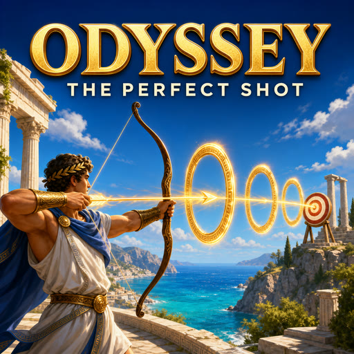
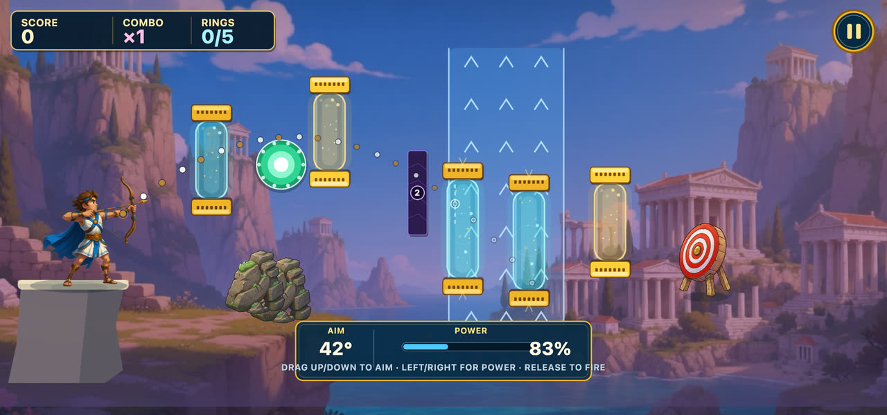
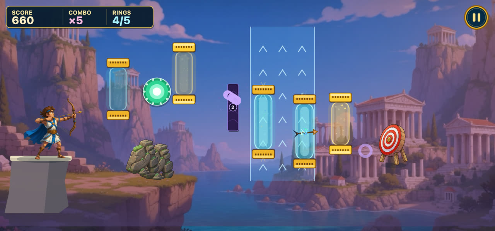

<p align="center">
  
</p>

# Odyssey: The Perfect Shot

A landscape, touch-first PixiJS archery game for RUN.world, built from
`rundot_template`.

Drag to aim Ulysses' bow, release **one** arrow, steer it gently in flight,
thread every glowing ring, and strike the target. Courses are generated
endlessly and get harder as you descend the ladder.



The preview shows exactly where the arrow goes — until it reaches a gust. Wind
bands truncate the prediction on purpose, so reading the drift is the skill.



```bash
npm install --cache /tmp/odyssey-npm-cache
npm run dev
npm run check:all
```

## Design brief

- Fantasy: make an impossible heroic shot across a bright Aegean landscape.
- Audience/session: mobile arcade players; landscape; 10–20 second courses.
- Core loop: aim, fire once, thread rings, hit the target, retry or descend.
- First value: the dotted arc and articulated hero respond immediately to drag.
- Goal ladder: land a hit; thread every ring; three-star the course; go deeper.
- Failure/recovery: a named miss reason and one-tap retry. Losing never costs depth.
- Controls/comfort: mouse/touch drag, subtle horizontal steering, no shake or zoom.
- Difficulty: an endless generated ladder that introduces one mechanic at a time —
  gold rings, wind, bumpers, obsidian, orbiting rings, irises, plates, crowns.
- Economy: drachmae earned from play buy the armory; heavier shafts smash
  obsidian and survive more ricochets, which is the wall that makes deeper
  courses need a better arrow rather than only more skill.
- Vertical slice proof: every generated course is re-flown by the shipping
  integrator at ten frame rates before it is allowed to ship.

The full specification is [`gdd.md`](gdd.md).

## Monetization

Both RUN channels are live and configured in
[`rundot/shop.config.json`](rundot/shop.config.json):

- **Navigator's Patronage** (durable) — +25% drachmae per clear, the results
  bounty without a video, and the Meltemi fletching.
- **Three drachmae packs** (consumable), priced so the value per Run Bit rises
  with the tier.
- **Rewarded placement** on the victory card: double what the course just paid.

Every arrow, course and star is reachable on drachmae earned from play. No
product changes shot physics, scoring, ring layouts, or course difficulty.
See [`docs/monetization.md`](docs/monetization.md).

## Verification

`npm run check:all` runs formatting, lint, the headless course prover, both
builds, and the Playwright suite. The prover clears 120 depths at ten frame
rates; the browser suite covers course fit on three viewports, per-depth
three-stars, wind, the shop, the rewarded bounty, and audio.
